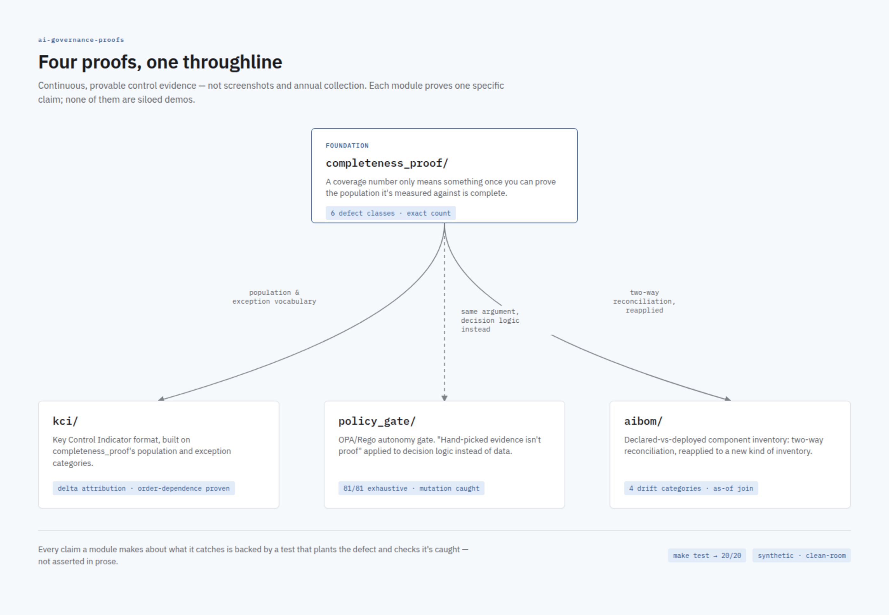

# ai-governance-proofs

Most GRC programs run on screenshots and annual evidence collection: a
control owner takes a snapshot once a quarter, an auditor samples a
handful of records, and everyone agrees to trust the number in between.
That works until someone asks the question a screenshot can't answer --
*how do you know the denominator was complete, that this metric means what
it says it means, that this decision would hold up if you tried it on
every input instead of the ones you happened to pick, or that what's
declared is what's actually running?*

This repo is four small, fully worked proofs that continuous, provable
control evidence is a different and buildable thing, applied to the
specific problem of governing AI systems that take autonomous action.
Each one picks a single claim a control program makes and either proves
it exactly or names precisely what it doesn't cover.



## What's here

- **[`completeness_proof/`](completeness_proof/)** -- the foundation the
  other three modules build on. A coverage number is only meaningful once
  you can prove the population it's measured against is complete, not
  just that the extract you happened to pull looks clean. Naive
  one-directional reconciliation vs. a proper two-way check, on a
  synthetic dataset with six seeded defect classes, each one found by
  exact count.

- **[`kci/`](kci/)** -- a Key Control Indicator definition format built
  directly on `completeness_proof`'s population/exception vocabulary,
  plus a worked demonstration of why a KCI's measurement logic needs a
  version identifier: a delta-attribution proof that separates a real
  change in control performance from a change in how the metric is
  computed, and shows that the split between them depends on which order
  you attribute the two effects in.

- **[`policy_gate/`](policy_gate/)** -- a generic OPA/Rego gate deciding
  whether an AI system's proposed action can proceed autonomously or
  needs a human. Its entire input space is small enough to enumerate
  completely (81 combinations), and doing so catches a one-word bug that
  a hand-picked test suite reaching 100% line coverage does not --
  proven with an actual planted mutant and a passing/failing test, not
  asserted in prose.

- **[`aibom/`](aibom/)** -- a schema for declaring which model, prompt,
  policy, and firewall version a system is supposed to be running, plus a
  drift-detection query that reapplies `completeness_proof`'s two-way
  reconciliation lesson to a new kind of inventory: declared checked
  against observed in both directions, at the specific point in time each
  observation happened, not just against whatever's currently declared.

None of these are siloed demos. `kci` is built on `completeness_proof`'s
categories; `aibom`'s drift check is `completeness_proof`'s central
argument (check both directions against an authoritative source) applied
to a different problem; `policy_gate`'s exhaustive-verification argument
is the same "hand-picked evidence isn't proof" theme the other three make
about data, applied to decision logic instead. Each module's README makes
its half of that connection explicit and links back.

## This is a clean-room build

Everything in this repo -- every dataset, every threshold, every
schema, every rule in the policy gate -- is written fresh against
synthetic data for this repo specifically. There is no client data, no
real prompts, no production thresholds or the business reasoning behind
them, no real schemas, and no code copied from any production system.
Where a module needed a concrete example to be worked rather than just
described, the example is fabricated and says so.

What's being demonstrated is the method -- how to structure a piece of
control evidence so a claim about it can actually be checked -- not any
particular implementation of it. If you're reading this to evaluate
whether the person who built it understands continuous control
monitoring, that's the right thing to be looking at; if you're reading it
to find out how any specific production system works, there's nothing
here about one.

## Running it

Everything runs locally. No cloud dependencies, no API keys.

```
pip install -r requirements.txt
make test
```

`policy_gate/` additionally needs the `opa` binary on `PATH` (a static
binary, not a pip package -- see
[openpolicyagent.org/docs](https://www.openpolicyagent.org/docs/#running-opa)).
Its tests skip themselves with a clear reason if `opa` isn't found rather
than failing the whole suite.

## Conventions across every module

- Python and SQL/Rego, dependencies kept minimal (`duckdb`, `pytest`,
  `jsonschema`, the `opa` binary).
- SQL is written to be read by an auditor, not just executed by a
  machine: CTEs over nesting, comments stating what each query proves
  and, just as often, what it explicitly does not.
- Every claim a module's README makes about what it catches is backed by
  a test that actually plants the defect and checks the code catches it
  -- a "this works" claim without that test is treated as not yet true.
- Each module is inspectable in under five minutes: small, hand-checkable
  synthetic datasets wherever the point being made doesn't require scale
  to demonstrate.
