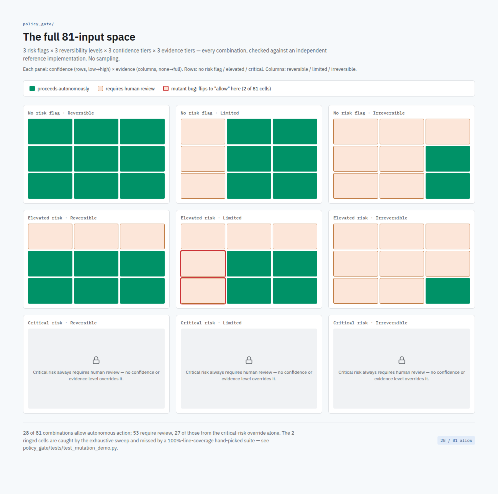

# Policy gate: autonomy decision, exhaustively verified

> A test suite that reaches 100% code coverage has shown every line can
> run. It has not shown every input produces the right answer. Those are
> different claims, and the gap between them is exactly where a plausible
> gate quietly ships a wrong decision.

This module is a generic Rego policy gate for a decision every AI system
that takes automated actions eventually needs: given a proposed action's
risk flag, the system's confidence in it, whether it can be undone, and
how much prior approval evidence has accumulated for actions like it, does
this one proceed on its own or go to a human first? The rules here are
written fresh for this repo -- a plausible, defensible decision table, not
a reproduction of any real production gate.

## The policy

[`rego/policy.rego`](rego/policy.rego) -- four string-valued inputs
(`risk_flag`, `confidence`, `reversibility`, `approval_evidence`, each
with 3 possible values), a decision table mapping `risk_flag` x
`reversibility` to the minimum confidence and evidence required, and one
unconditional rule: `risk_flag == "critical"` always requires human
review, full stop, regardless of how favorable the other three inputs are.

## Two layers of testing, and why there are two

**[`rego/policy_test.rego`](rego/policy_test.rego)** -- 13 hand-picked
Rego unit tests, one "exactly meets the requirement" and one "falls one
level short" case per table cell, plus two cases proving the critical-risk
override. [`tests/test_coverage.py`](tests/test_coverage.py) runs this
suite through `opa test --coverage` and asserts the reported number is
literally 100% -- every line of `policy.rego` executes at least once
across the suite.

**[`tests/test_exhaustive_sweep.py`](tests/test_exhaustive_sweep.py)** --
the input space here is small enough to enumerate completely: 4 fields x
3 values each = 81 combinations, no sampling. Every one is evaluated
against the real policy via `opa eval` and checked against
[`reference/reference.py`](reference/reference.py), an independently
written Python reimplementation of the same table (a plain if/elif
ladder, deliberately structured differently from the Rego version's
dict-of-dicts lookup, so a bug has to reproduce itself in two
structurally different implementations to survive). The test also asserts
the exact allow/deny split -- 28 allow, 53 deny -- worked out by hand from
the table in the test file's own comments, independently of what either
implementation returns, so the test can't pass merely because both
implementations happen to agree while both being wrong the same way.



## Why exhaustive verification beats hand-picked test cases

100% line coverage proves every rule body *ran*. It says nothing about
whether it ran correctly on every input that reaches it, because a test
suite only samples the inputs someone thought to write down. A rule can
execute on every single test in a suite and still compute the wrong thing
for an input class the suite's author didn't happen to construct -- and
with four correlated fields, "didn't happen to construct" is easy: a
suite that tests each field's boundary in isolation, holding the others at
their "obviously fine" value, can rack up 100% coverage while never trying
several fields at their boundaries simultaneously.

[`mutants/policy_evidence_off_by_one.rego`](mutants/policy_evidence_off_by_one.rego)
makes this concrete instead of asserting it. It's `policy.rego` with one
table cell's evidence requirement quietly downgraded -- `"partial"`
weakened to `"none"` for elevated-risk, limited-reversibility actions.
[`tests/test_mutation_demo.py`](tests/test_mutation_demo.py) proves two
things about it with actual tests, not commentary:

1. `policy_test.rego` -- the 100%-line-coverage suite above -- **passes
   unchanged** against this broken policy. Every line the mutation touches
   still executes during that suite; none of the 13 hand-picked inputs
   happens to be the specific combination the bug affects.
2. The exhaustive sweep, run against the same broken policy, **fails** --
   and fails on precisely the two input combinations (out of 81) that a
   by-hand analysis of the one-line diff predicts it should.

That combination -- a plausible, easy-to-make bug that a carefully
written, fully-covered unit test suite does not catch, caught immediately
and exactly by exhaustive enumeration -- is the actual argument for
building the sweep whenever the input space is small enough to make it
affordable, rather than trusting a coverage percentage to mean more than
it does.

## Running it

Requires the `opa` binary on `PATH` (a static binary, not a pip package --
see [openpolicyagent.org/docs](https://www.openpolicyagent.org/docs/#running-opa)
for install instructions). The Python tests skip themselves with a clear
reason if `opa` isn't found, rather than failing.

```
pip install -r ../requirements.txt
opa test rego/ -v                        # the Rego suite directly
python3 -m pytest tests/ -v              # coverage check + exhaustive sweep + mutation demo
```

Or from the repo root: `make test`.
